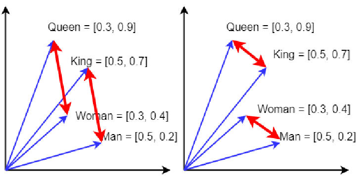

# Train a custom Word2Vec model on a small dataset. Train embeddings on a domain-specific corpus (e.g., legal, medical) and analyze how embeddings capture domain-specific semantics.

---

In the context of Generative AI (Gen AI), a "vector" is a mathematical representation of data as a list of numbers, where each number corresponds to a specific feature or attribute. This allows AI algorithms to understand and process information effectively.



A machine learning algorithm that converts words into vectors captures their meanings and relationships with other words. This process is a core component of Natural Language Processing (NLP).

NLP can refer to either Natural Language Processing or Neuro-linguistic Programming. 

**Natural Language Processing (NLP)**:
- A machine learning technology that helps computers understand human language.
- A key component of many applications, such as AI and chatbots.
- Utilizes techniques like tokenization, part-of-speech tagging, and sentiment analysis.
- Aids computers in interpreting, manipulating, and comprehending human language.
- Used in machine translation, chatbots, and question-answering software.

---
### Python Code:

```python
from gensim.models import Word2Vec

# Custom Word2Vec model
def custom_word2vec(corpus):
	model = Word2Vec(
		sentences = corpus,
		vector_size = 50, # Dimensionality of word vectors
		window = 5,	      # Context window size
		min_count = 1,	  # Minimum frequency for a word to be considered
		workers = 4,      # Number of worker threads
		epochs = 10,	  # Number of training epochs
	)
	return model

# Analyze trained embeddings
def analyze(model, word):
	similar_words = model.wv.most_similar(word, topn=5)
	for word, score in similar_words:  
		print(f"{word}: {score}")

# Example domain-specific dataset (medical/legal/etc.)
corpus = [
	"The patient was prescribed antibiotics to treat the infection.".split(),
	"The court ruled in favor of the defendant after reviewing the evidence.".split(),
	"Diagnosis of diabetes mellitus requires specific blood tests.".split(),
	"The legal contract must be signed in the presence of a witness.".split(),
	"Symptoms of the disease include fever, cough, and fatigue.".split(),
]

model = custom_word2vec(corpus)

print("Analysis for word patient:")
analyze(model, "patient")
print("\nAnalysis for word court:")
analyze(model, "court")

```
---