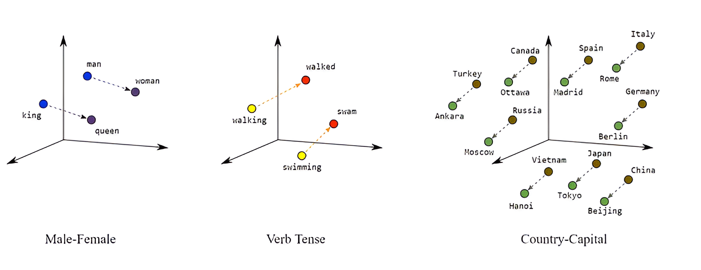

# Explore pre-trained word vectors. Explore word relationships using vector arithmetic. Perform arithmetic operations and analyze results.

---

Word embeddings (also called word vectors) represent each word numerically in such a way that the vector corresponds to how that word is used or what it means. Vector encodings are learned by considering the context in which the words appear. Words that appear in similar contexts will have similar vectors. For example, vectors for "leopard", "lion", and "tiger" will be close together, while they'll be far away from "planet" and "castle".

Even cooler, relations between words can be examined with mathematical operations. Subtracting the vectors for "man" and "woman" will return another vector. If you add that to the vector for "king" the result is close to the vector for "queen."



One popular method for generating word vectors is called Word2Vec. This algorithm takes a large corpus of text and learns word embeddings by predicting the context in which words appear.

Word2Vec works by training a neural network on a large amount of text data. The neural network learns to predict the probability of a word appearing in the context of other words. By doing this, it learns to represent each word as a vector in a high-dimensional space. These word vectors capture the semantic meaning of words and their relationships with other words.

---
### Python Code:

```python
from gensim.models import KeyedVectors  

def explore_word_relationships(model_path):  
    try:  
        print("Loading the model...")  
        # Load the model without memory mapping  
        word_vectors = KeyedVectors.load_word2vec_format(model_path, binary=True)  
        print("Model loaded successfully!")  
			
        # Define the words for vector arithmetic  
        words = ['king', 'man', 'woman']  
			  
        # Check if the words exist in the model  
        for word in words:  
            if word not in word_vectors:  
                print(f"Warning: '{word}' not found in the model.")  
                return  
				
        # Perform vector arithmetic (king - man + woman)  
        result_vector = word_vectors['king'] - word_vectors['man'] + word_vectors['woman']  
			
        # Fetch the top 5 similar words to the result_vector  
        similar_words = word_vectors.similar_by_vector(result_vector, topn=5)  
			
        # Print the similar words  
        print("Similar words found:")  
        for word, score in similar_words:  
            print(f"{word}: {score}")  
			
    except Exception as e:  
        print(f"Error: {e}")  
		
# Path to your model  
model_path = '/home/pc/Downloads/GoogleNews-vectors-negative300.bin'  # Modify as per your path   
explore_word_relationships(model_path)
```
---