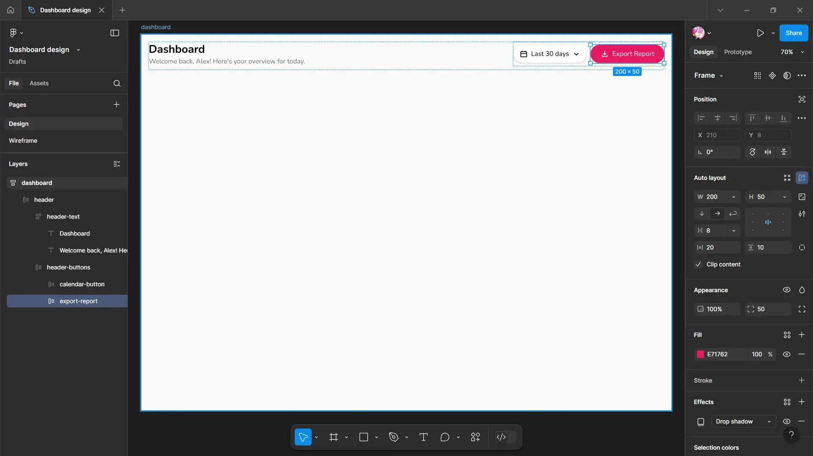

# Dashboard Design

In our seventh experiment, we will focus on creating a wireframe and designing a prototype for a Dashboard UI page. This involves integrating various dashboard elements, including statistics, graphs, and dropdown options for detailed data visualization.

For this dashboard, we will utilize a custom prototype. You can view the prototype [here](https://violetto-rose.github.io/UI-UX/public/resources/dashboard.html):

<iframe src="https://violetto-rose.github.io/UI-UX/public/resources/dashboard.html"></iframe>

By incorporating user-friendly features and visual analytics, we aim to enhance usability and provide valuable insights through the Dashboard UI.

---

## 1. Wireframing

Create a basic wireframe using pen and paper, as demonstrated below:

{data-aspect-ratio="4:3"}

---
### ▶ Creating a Landing Page

To create a frame:

1. We'll use the **Desktop** frame for this design:
	- Layout: Vertical
	- Alignment: Top Center
	- Gap: **0**
	- Horizontal padding & Vertical padding: **20** pixels
	- Fill: **#FAF9F9**

### ▶ Creating a Header

1. Create the frame:
	- Dimensions: **Fill x Hug**
	- Layout: Horizontal
	- Gap: Auto
	- Horizontal padding: **0**
	- Vertical padding: **0, 20** pixels
	- Stroke: 
		- Color: **#F3F2F2**

2. Create header text container:
    - Dimensions: **Hug**
    - Layout: Vertical
    - Alignment: Left
    - Gap, Horizontal padding & Vertical padding: **0**
3. Add "Dashboard" and "Welcome back, Alex! Here's your overview for today." text element.

4. Create header button container:
    - Dimensions: **Hug x Fill**
    - Layout: Horizontal
	- Alignment: Center
    - Horizontal padding & Vertical padding: **0**

5. Create calendar button:
    - Dimensions: **200 x 50** pixels
    - Layout: Horizontal
	- Alignment: Center
	- Gap: **8** pixels
    - Horizontal padding: **20** pixels
    - Fill: **#FFFFFF**
	- Stroke: 
		- Color: **#EBEAEA**
	- Effects: Drop Shadow
		- X: 0
		- Y: 1
		- Blur: 2
		- Color: **#000000** at 25% opacity

6. Create export button:
    - Dimensions: **200 x 50** pixels
    - Layout: Horizontal
	- Alignment: Center
	- Gap: **8** pixels
    - Horizontal padding: **20** pixels
    - Fill: **#E71762**
	- Effects: Drop Shadow
		- X: 0
		- Y: 1
		- Blur: 2
		- Color: **#000000** at 25% opacity

### ▶ Creating Stats count Container

1. Create a frame:
    - Dimensions: **Fill x Hug**
    - Layout: Horizontal
    - Alignment: Center
    - Gap: **20** pixels
    - Horizontal padding: **0**
    - Vertical padding: **20** pixels

2. Creating total revenue container:
    - Dimensions: **Fill x Hug**
    - Layout: Horizontal
    - Alignment: Top Center
    - Horizontal padding & Vertical padding: **20** pixels
    - Fill: **#FFFFFF**
	- Stroke: 
		- Color: **#EBEAEA**
	- Effects: Drop Shadow
		- X: 0
		- Y: 1
		- Blur: 2
		- Color: **#000000** at 25% opacity

3. Create text container:
    - Dimensions: **Fill x Hug**
    - Layout: Vertical
	- Alignment: Left
	- Gap, Horizontal padding & Vertical Padding: **0**
	- Colors: **#6B7280**, **#16A34A**

4. Create icon button:
    - Dimensions: **50 x 50** pixels
    - Layout: Vertical
	- Alignment: Center
	- Gap, Horizontal padding & Vertical Padding: **0**
    - Fill: **#FFE3E9**
5. Add dollar icon:
	- Fill: **#E71762**

6. Duplicate total revenue container for total users, active sessions and conversion rate containers:
    - Fill: **#DBEAFE**, **#F3E8FF**, **#FEF3C7**
7. Add person, monitoring and trending up icons:
	- Fill: **#235EDF**, **#9333EA**, **#D97706**

### ▶ Creating Statistics Container

1. Create a frame:
    - Dimensions: **Fill x Hug**
    - Layout: Wrap
    - Alignment: Center
    - Horizontal gap: **25** pixels
    - Vertical gap: **20** pixels
    - Horizontal padding: **0**
    - Vertical padding: **0, 10** pixels

### ▶ Creating Revenue Overview Container

1. Create a frame:
    - Dimensions: **920 x 450** pixels
    - Layout: Vertical
    - Alignment: Top Center
    - Horizontal padding & Vertical padding: **20** pixels
    - Fill: **#FFFFFF**
	- Stroke: 
		- Color: **#EBEAEA**
	- Effects: Drop Shadow
		- X: 0
		- Y: 1
		- Blur: 2
		- Color: **#000000** at 25% opacity

2. Create a header container:
    - Dimensions: **Fill x Hug**
    - Layout: Horizontal
    - Alignment: Center
    - Gap: Auto
    - Horizontal padding & Vertical padding: **20** pixels
3. Add "Revenue Overview" text element.
4. Create drop down button:
    - Dimensions: **Hug**
    - Layout: Horizontal
	- Alignment: Center
    - Vertical padding: **5** pixels
    - Fill: **#F3F4F6**
	- Stroke: 
		- Color: **#EBEAEA**
	- Effects: Drop Shadow
		- X: 0
		- Y: 1
		- Blur: 2
		- Color: **#000000** at 25% opacity
5. Add "Monthly" text element.
6. Add "Bottom arrow" icon.

7. Add line chart.

### ▶ Creating Traffic Sources Container

1. Duplicate revenue overview container.
2. Change frame configuration:
    - Dimensions: **450 x 450** pixels

3. Change header's "Revenue Overview" text to "Traffic Sources" and drop down button's "Monthly" text to "Last Week".
4. Change graph to Donut.

### ▶ Creating Top Products Container

1. Duplicate revenue overview container.
2. Change frame configuration:
    - Dimensions: **450 x 580** pixels
3. Change header's "Traffic Sources" text to "Top Products" and drop down button's "Last Week" text to "By Revenue".

4. Create a product container:
    - Dimensions: **Fill x Hug**
    - Layout: Vertical
    - Alignment: Center
    - Gap: Auto
    - Horizontal padding & Vertical padding: **20** pixels

5. Create a product:
    - Dimensions: **Fill x Hug**
    - Layout: Horizontal
    - Alignment: Center
6. Create icon button:
    - Dimensions: **50 x 50** pixels
    - Layout: Vertical
	- Alignment: Center
	- Gap, Horizontal padding & Vertical Padding: **0**
    - Fill: **#DBEAFE**
7. Add smartphone icon:
	- Fill: **#2563EB**
8. Create a product description container:
    - Dimensions: **Fill x Hug**
    - Layout: Vertical
    - Alignment: Left
9. Add "Premium Smartphone X12", "1,245 units" and "$248,900" text elements.
10. Add a progress bar:
	- Fill: **#2563EB**

11. Duplicate the product and change colors, icons and text to:
	 1. Headphones:
		 - Fill: **#9333EA**
		 - Background color: **#F3E8FF**
		 - Text: "Wireless Noise Cancelling Headphones", "978 units" and "$195,600"
	2. Watch:
		 - Fill: **#D97706**
		 - Background color: **#FEF3C7**
		 - Text: "Smart Watch Pro Series 4", "745 units and "$149,000"
	3. Laptop:
		 - Fill: **#16A34A**
		 - Background color: **#DCFCE7**
		 - Text: "UltraBook Pro 13"", "512 units and "$112,640"
	4. Speaker:
		 - Fill: **#DC2626**
		 - Background color: **#FEE2E2**
		 - Text: "Portable Bluetooth Speaker", "489 units and "$97,800"

### ▶ Creating User Demographics Container

1. Duplicate top products container.
2. Change header's "Top Products" text to "User Demographics" and drop down button's "By Revenue" text to more options icon.
3. Change graph to bar chart.
4. Create demographics stats container:
    - Dimensions: **Fill x Hug**
    - Layout: Vertical
	- Alignment: Top Left
	- Gap: **16** pixels
	- Horizontal padding & Vertical Padding: **0**
5. Create three frames for stats:
    - Dimensions: **Fill x Hug**
    - Layout: Vertical
	- Alignment: Center
	- Fill: **#F9FAFB**
6. Add text elements:
	- 58% - From America
	- 24% - From Europe
		- 18% - From Asia

### ▶ Creating Recent Activities Container

1. Duplicate user demographics container.
2. Change the drop down button to "View All" text element:
	- Fill: **#E71762**

3. Create a activity container:
    - Dimensions: **Fill x Hug**
    - Layout: Horizontal
    - Alignment: Top Left
    - Gap, Horizontal padding & Vertical padding: **0**

4. Create a graphics container:
    - Dimensions: **Hug x Fill**
    - Layout: Vertical
    - Alignment: Top Left
    - Gap: **76** pixels
    - Vertical padding: **12, 0** pixels
5. Add circle icons:
	- Primary: **#16A34A**, Secondary: **#DCFCE7**
	- Primary: **#2563EB**, Secondary: **#DBEAFE**
	- Primary: **#D97706**, Secondary: **#FEF3C7**
	- Primary: **#9333EA**, Secondary: **#F3E8FF**
	- Primary: **#DC2626**, Secondary: **#FEE2E2**

6. Create a activity sub container:
    - Dimensions: **Fill**
	- Layout: Vertical
    - Alignment: Center
    - Gap, Horizontal padding & Vertical padding: **0**

7. Create a activity:
    - Dimensions: **Fill x 100** pixels
	- Layout: Vertical
    - Alignment: Left
    - Gap: **4** pixels
    - Horizontal padding & Vertical padding: **0**

8. Add "New Order Placed", "2 hours ago", "User #23145 placed an order for $542.20" text elements.
9. Add "By Revenue" and "Contact User" buttons.

10. Duplicate the activities.

### ▶ Final Design

Through our focused efforts, we have created a well-structured and visually compelling design for the Dashboard UI. This design prioritizes data accessibility and user engagement, ensuring that users can effortlessly navigate through statistics, graphs, and detailed data visualizations.

{data-aspect-ratio="4:3"}

---