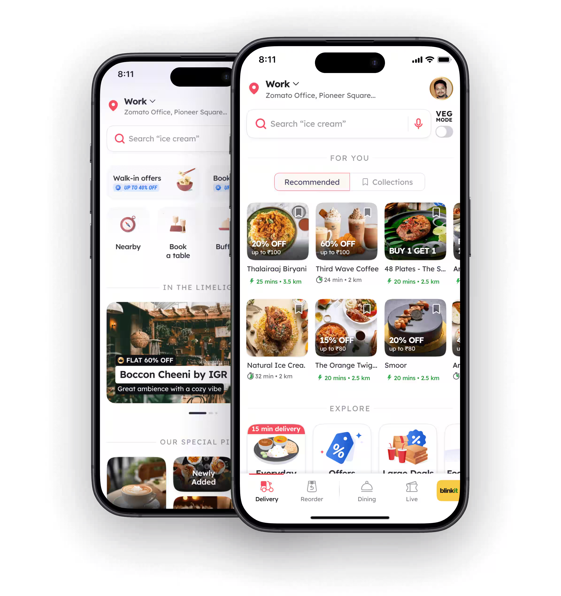

Our second experiment is creating a Food App design where we will create a wireframe and design the user interface of a well-known chat application and make a prototype

For our experiment, we'll focus on Zomato, a popular food delivery and restaurant discovery platform. Zomato exemplifies excellent user interface design through its user-friendly navigation, organized visual hierarchy, and cohesive design elements. It provides a seamless experience for users to explore restaurants, read reviews, and place orders conveniently.

  
_New iOS user interface on Zomato. Image source: Zomato Official Website, 2025._

Let's begin by designing the home screen interface for Zomato, along with the restaurant page interface.

---
## 1. Wireframing

Create a basic wireframe using pen and paper, as demonstrated below:

{data-aspect-ratio="1:1"}

---
## 2. Designing