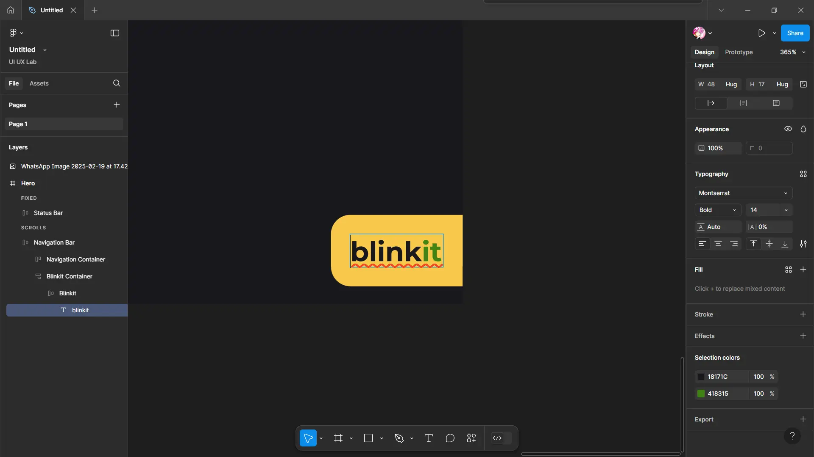

# Food App

Our second experiment focuses on creating a food app design, where we will develop a wireframe and user interface for a well-known chat application, as well as a prototype.

For this experiment, we will concentrate on Zomato, a popular food delivery and restaurant discovery platform. Zomato exemplifies excellent user interface design through its user-friendly navigation, organized visual hierarchy, and cohesive design elements. It provides a seamless experience for users to explore restaurants, read reviews, and conveniently place orders.

{data-aspect-ratio="1:1"}
_Zomato interface on Apple iOS. Image source: Zomato Official Website, 2025._

Let's begin by designing the home screen interface for Zomato, along with the restaurant page interface.

> **Disclaimer**:  
> 
> The images, logos, and brand elements of Zomato used in this website redesign are the intellectual property of Zomato Media Pvt. Ltd. and are utilized here for educational purposes only. This website is not affiliated with or endorsed by Zomato. All trademarks and copyrights are the property of their respective owners.  
> 
> Please ensure that all usage of Zomato logos, icons, and products adheres to their brand guidelines. For any commercial use or modifications, please obtain the necessary permissions from Zomato.

---
## 1. Wireframing

Create a basic wireframe using pen and paper, as demonstrated below:

{data-aspect-ratio="1:1"}

---
## 2. Designing

> **Disclaimer**:
> 
> The Metropolis font is the intellectual property of its original author and is provided here for personal use only. This tutorial uses the font for educational purposes only. For commercial use, please ensure you obtain the appropriate license from the author. By downloading, you acknowledge that you respect the rights of the original creator.
> 
> You can download the Metropolis font **[here](https://violetto-rose.github.io/UI-UX/public/resources/Metropolis.zip)**.

### ▶ Creating a Landing Page

To create a frame:

1. We'll use the **Android Compact** frame for this design.
2. Change the fill color to **#18171C**.

### ▶ Adding the Status Bar

1. Open the Status Bar 1-click plugin from the Actions menu.
2. Change the height of the status bar to **50** pixels.

### ▶ Creating the Navigation Bar

1. Create the navigation frame:
	- Dimensions: **412 x 55** pixels
	- Layout: Horizontal 
	- Alignment: Center
	- Gap, Horizontal padding & Vertical padding: **0**
	- Stroke: 
		- Color: **#29282D**
		- Position: Inside

### ▶ Creating the Navigation Container

1. Create a frame:
	- Dimensions: **325 x 55** pixels
	- Layout: Horizontal 
	- Alignment: Center
	- Gap, Horizontal padding: **20** pixels
	- Vertical padding: **10** pixels

### ▶ Creating the Blinkit Container

1. Create a frame:
	- Dimensions: **87 x 55** pixels
	- Layout: Vertical 
	- Alignment: Right
	- Gap, Vertical padding: **10** pixels
	- Horizontal padding: **0**

### ▶ Adding Blinkit

1. Create a frame:
	- Dimensions: **Hug**
	- Layout: Horizontal 
	- Alignment: Right
	- Gap: **0**
	- Horizontal padding: **10, 0** pixels
	- Vertical padding: **10** pixels
	- Color: **#F8C94B**
	- Cornering radius:
		- Top Left and Bottom Left corner radius: **10** pixels
		- Top Right and Bottom Right corner radius: **0**

2. Adding Blinkit text element:
	- Dimensions: **Hug**
	- Font: Montserrat
	- Size: **14** pixels
	- Weight: Bold
	- Color: **#18171C** and **#418315**

3. Add arrow icon
	- Rotation: **-45** degree
	- Dimensions: **15** pixels
 

### ▶ Creating the Delivery Container

1. Create a frame:
	- Dimensions: **80 x 55** pixels
	- Layout: Vertical 
	- Alignment: Center
	- Gap: **5** pixels
	- Horizontal padding & Vertical padding: **0**
	- Stroke: 
		- Color: **#1D7548**
		- Position: Inside
		- Sides: Top
		- Thickness: **3** pixels

2. Add delivery icon
	- Color: **#269644**
	- Dimensions: **24** pixels

3.  Adding delivery text element:
	- Dimensions: **Hug**
	- Font: Metropolis
	- Size: **12** pixels
	- Weight: Medium

4. Repeat the same for other navigation buttons:
	- Color: **#85888F**

### ▶ Creating the Body Container

1. Create a frame:
	- Dimensions: **412 x 812** pixels
	- Layout: Vertical 
	- Alignment: Center
	- Gap & Horizontal padding: **10** pixels
	- Vertical padding: **0**

### ▶ Creating the Location Container

1. Create a frame:
	- Dimensions: **412 x 50** pixels
	- Layout: Horizontal 
	- Alignment: Center
	- Gap: **0**
	- Horizontal padding: **10, 20** pixels

2. Add location icon
	- Color: **#23933C**
	- Dimensions: **25** pixels
3. Add location frame:
	- Dimensions: **Fill x Hug**
	- Layout: Vertical
	- Alignment: Left
	- Gap & Vertical padding: **0**

4. Add place text element:
	- Font: Metropolis
	- Size: **16** pixels
	- Weight: Semi Bold
5. Add bottom arrow icon.

6. Add location address frame:
	- Dimensions: **Fill x 25** pixels
	- Layout: Vertical
	- Alignment: Top Left
	- Horizontal padding: **0**
	- Vertical padding: **2** pixels
7. Add address text element.
8. Add a **30 x 30** icon.

### ▶ Creating the Search Container

1. Create a frame:
	- Dimensions: **412 x 50** pixels
	- Layout: Horizontal 
	- Alignment: Center
	- Gap: **0**

### ▶ Creating the Search Bar

1. Create a frame:
	- Dimensions: **335 x 40** pixels
	- Layout: Horizontal 
	- Alignment: Left
	- Horizontal padding & Vertical padding: **0**
	- Color: **#202126**
	- Cornering radius: **10** pixels
	- Stroke: 
		- Color: **#434448**
		- Position: Inside

2. Add search icon and search text element.

4. Add a microphone icon.

5. Add a veg mode goggle container:
	- Dimensions: **Fill x 51** pixel
	- Layout: Vertical 
	- Alignment: Center
	- Gap, Horizontal padding & Vertical padding: **0**
6. Add veg mode text element.
7. Add toggle icon:
	- Color: **#0BB665**

### ▶ Creating the Food Type Container

1. Create a frame:
	- Dimensions: **412 x 90** pixels
	- Layout: Horizontal 
	- Alignment: Right
	- Horizontal padding: **0**
	- Vertical padding: **10, 0** pixels
2. Add a dummy image for flash sale.

3. Create a menu item container:
	- Dimensions: **308 x 80** pixels

4. Create a menu item:
	- Dimensions: **80 x 80** pixels

5. Add fast food text element:
	-  Font: Metropolis
	- Size: **10** pixels
	- Weight: Medium
6. Add a stroke for 1st menu item:
	- Color: **#1D7548**
	- Position: Inside
	- Sides: Bottom
	- Thickness: **3** pixels

7. Duplicate the menu item.

### ▶ Creating the Filters Container

1. Create a frame:
	- Dimensions: **412 x 70** pixels
	- Layout: Horizontal 
	- Alignment: Center
	- Horizontal padding: **0**

2. Add a filter button:
	- Dimensions: **Hug**
	- Layout: Horizontal 
	- Alignment: Center
	- Color: **#202126**
	- Corner radius: **10** pixels
	- Gap: **5** pixels
	- Stroke:
		- Color: **#302F34**
		- Position: Inside

3. Add icons and text element.

4. Duplicate for different filters.

### ▶ Creating the Explore More Container

1. Create a frame:
	- Dimensions: **412 x 185** pixels
	- Layout: Vertical 
	- Alignment: Left
	- Horizontal padding: **14** pixels
	- Vertical padding: **12, 0** pixels
2. Add a explore more text element
3. Create a more options container:
	- Dimensions: **Fill x 148** pixels
	- Layout: Horizontal 
	- Alignment: Center
	- Horizontal padding: **0**
	- Vertical padding: **5, 0** pixels
4. Create a offers button:
	- Dimensions: **120 x 140** pixels
	- Layout: Vertical 
	- Alignment: Center
	- Horizontal padding: **24** pixels
	- Vertical padding: **55** pixels
	- Color: **#202028**
	- Cornering radius: **10** pixels

1. Add icon and text elements.
2. Duplicate for different buttons.

### ▶ Creating the Restaurants Container

1. Create a frame:
	- Dimensions: **412 x 790** pixels
	- Layout: Vertical 
	- Alignment: Top Left
	- Gap: **15** pixels
	- Vertical padding: **20, 10** pixels
2. Add all restaurants text element
3. Create a restaurants container:
	- Dimensions: **Fill x 315** pixels
	- Layout: Vertical 
	- Alignment: Top Center
	- Gap, Horizontal padding & Vertical padding: **0**
	- Color: **#202126**
	- Cornering radius: **20** pixels
	- Stroke:
		- Color: **#333439**
		- Position: Inside

4. Add a image item:
	- Dimensions: **392 x 245** pixels

5. Create restaurant cards accordingly.

### ▶ Creating a Restaurant Page

To create a frame:

1. We'll use the **Android Compact** frame again for this design.
2. Change the fill color to **#18171C
3. Add a frame for header:
	- Dimensions: **412 x 250** pixels
	- Layout: Vertical 
	- Alignment: Center
	- Gap, Vertical padding: **0**
	- Stroke:
		- Color: **#202125**
		- Position: Inside
		- Sides: Bottom
		- Thickness: **8** pixels

### ▶ Creating a Options Container

1. Create a options container:
	- Dimensions: **Fill x 50** pixels
	- Layout: Horizontal
	- Alignment: Center
	- Gap: **0**
2. Create two sub-container for back and more options:
	- Dimensions: **186 x 50** pixels
	- Layout: Vertical
	- Alignment: Back container: Left; More options container: Right
	- Gap: **0**
3. Add icons for back, more people, bookmark and more options.

### ▶ Creating a Restaurant Description Container

1. Create a restaurant description container:
	- Dimensions: **Fill**
	- Layout: Vertical 
	- Alignment: Center
	- Gap, Horizontal padding & Vertical padding: **0**
2. Add a frame:
	- Dimensions: **Fill x 25** pixels
	- Layout: Horizontal 
	- Alignment: Left
	- Gap & Vertical padding: **0**
	- Horizontal padding: **5** pixels
3. Add a pure veg tag:
	- Dimensions: **80 x 20** pixels
	- Layout: Horizontal 
	- Alignment: Center
	- Gap: **5** pixels
	- Vertical padding: **0**
	- Horizontal padding: **1** pixel
	- Color: Linear gradient (**#16271F** to **#18171C**)

4. Create restaurant name container:
	- Dimensions: **Fill**
	- Layout: Horizontal 
	- Alignment: Left
	- Gap, Horizontal padding & Vertical padding: **0**
5. Add restaurant name and information icon.

6. Add ratings container:
	- Dimensions: **Fill**
	- Layout: Vertical 
	- Alignment: Right
	- Gap: **6** pixels

7. Add location container:
	- Dimensions: **Fill**
	- Layout: Vertical 
	- Alignment: Left
	- Gap, Horizontal padding & Vertical padding: **0**
8. Add distance and schedule sub-containers.

9. Add offers container
	- Dimensions: **Fill**
	- Layout: Horizontal 
	- Alignment: Left
	- Gap: **0**
	- Horizontal padding: **4** pixels
	- Vertical padding: **5, 10** pixels
	- Stroke:
		- Color: **#302F34**
		- Position: Inside
		- Sides: Top

### ▶ Creating the Search and Menu Container

1. Create a search bar and a menu button at the bottom, similar to the search bar on the landing page.

### ▶ Create a Body with Filters and Menu Items Container

1. Create filter buttons, flash sale description and menu cards accordingly

### ▶ Connect the pages using the Prototype option

1. Connect the **Restaurants** container to the **Restaurant** page to navigate to the restaurant page, which contains information about the restaurant and its menu.
2. Connect the **Back** button to return to the **Landing** page.

### ▶ Final Design

With these meticulous steps, we've created a comprehensive, user-friendly design for the Zomato interface. The design balances functionality with aesthetic appeal, providing an intuitive user experience.

{data-aspect-ratio="1:1"}

---