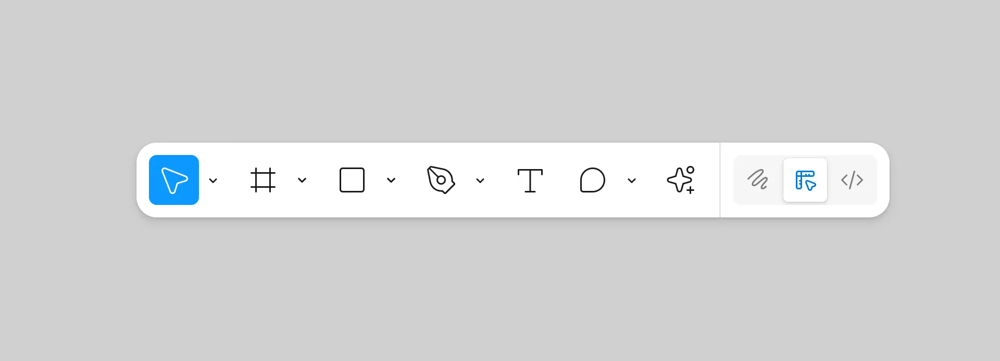

# Figma Interface: Tools & Properties Guide

## 1. Tools

{data-aspect-ratio="4:3"}

The toolbar is your command center in Figma. Here's what each tool does and when to use it.

### Move Tools

**Move Tool (V)** - Select and move objects (default tool)
**Hand Tool (H)** - Navigate without selecting objects
**Scale Tool (K)** - Resize objects while maintaining proportions

### Region Tools

**Frame Tool (F)** - Create containers for your design elements
**Section Tool** - Organize files and mark content for development
**Slice Tool (S)** - Define areas for export

### Shape Tools

**Rectangle (R)** - Squares, rectangles, rounded corners
**Line (L)** - Straight lines and dividers
**Arrow** - Directional indicators
**Ellipse (O)** - Circles and ovals
**Polygon** - Multi-sided shapes
**Star** - Star shapes
**Image/Video** - Import media files

### Creation Tools

**Pen Tool (P)** - Create custom vector shapes and paths
**Pencil Tool** - Freehand drawing with automatic smoothing

### Text Tool

**Text Tool (T)** - Add typography to your designs

- Click once for growing text
- Click and drag for fixed-size text containers

### Comment Tools

**Comment Tool (C)** - Add feedback and annotations
**Annotation Tool** - Highlight properties for developers
**Measurement Tool** - Show spacing and sizing

### Actions Menu

**AI Tools** - Generate designs and content
**Asset Search** - Find library components
**Plugins** - Extend functionality
**Quick Commands** - Common workspace actions

### Special Modes

**Dev Mode (Shift + D)** - Developer-focused interface for handoffs
**Figma Draw** - Advanced drawing and illustration tools

---

## 2. Properties Panel

The properties panel (right sidebar) shows all the properties of your selected element. Here's what you'll find:

### Layout Properties

**Position & Size**

- **X, Y** - Exact position coordinates
- **Width, Height** - Dimensions in pixels
- **Rotation** - Angle in degrees
- **Scale** - Size multiplier (X%, Y%)

**Constraints**

- **Left, Right, Top, Bottom** - How element responds to parent resizing
- **Center, Scale** - Centering and scaling behaviors

**Auto Layout**

- **Direction** - Horizontal or vertical stacking
- **Spacing** - Gap between elements
- **Padding** - Internal spacing
- **Alignment** - How elements align within container
- **Freeform** - Elements positioned manually without constraints
- **Grid** - Elements arranged in rows and columns with consistent spacing
- **Hug** - Container shrinks to fit content exactly
- **Fill** - Container expands to fill available space
- **Min/Max** - Set minimum and maximum dimensions for responsive behavior

### Design Properties

**Fills**

- **Color** - Solid colors, gradients, or images
- **Opacity** - Transparency level (0-100%)
- **Blend Mode** - How layers interact

**Strokes**

- **Color** - Border color
- **Weight** - Border thickness
- **Style** - Solid, dashed, dotted
- **Position** - Inside, center, or outside

**Effects**

- **Drop Shadow** - Depth and dimension
- **Inner Shadow** - Inset shadows
- **Background Blur** - Blur content behind the element
- **Layer Blur** - Blur the element itself
- **Noise** - Add texture and grain to elements
- **Texture** - Apply surface patterns and materials
- **Glass** - Create frosted glass or transparency effects

### Typography Properties

**Font**

- **Family** - Font selection
- **Style** - Bold, italic, etc.
- **Size** - Text size in pixels

**Text Settings**

- **Line Height** - Vertical spacing
- **Letter Spacing** - Character spacing
- **Paragraph Spacing** - Block spacing
- **Text Align** - Left, center, right, justify

### Component Properties

**Instance Properties**

- **Overrides** - Customize component instances
- **Swap** - Change to different component
- **Detach** - Break component connection

**Variant Properties**

- **State** - Different component states
- **Size** - Component size variants
- **Style** - Visual style variants

### Advanced Properties

**Prototyping**

- **Interactions** - Click, hover, drag behaviors
- **Animations** - Transition types and timing
- **Smart Animate** - Auto-animation between frames

**Export**

- **Format** - PNG, JPG, SVG, PDF
- **Scale** - 1x, 2x, 3x for different densities

---

## Essential Shortcuts

| Tool             | Shortcut  |
| ---------------- | --------- |
| Move             | V         |
| Frame            | F         |
| Rectangle        | R         |
| Text             | T         |
| Pen              | P         |
| Comment          | C         |
| Hand (temporary) | Spacebar  |
| Dev Mode         | Shift + D |

---

## Quick Tips

1. **Start with Frames** - Always use frames to organize your designs
2. **Use Shortcuts** - Learn keyboard shortcuts to work faster
3. **Comment Early** - Add feedback as you work
4. **Organize with Sections** - Keep large files navigable
5. **Master Properties** - Use the properties panel for precise control

_Practice using each tool and property to understand their capabilities. The more you use them, the more intuitive they become!_

For more details about other tools, visit [Figma&#39;s toolbar help page](https://help.figma.com/hc/en-us/articles/360041064174-Access-design-tools-from-the-toolbar).

---
