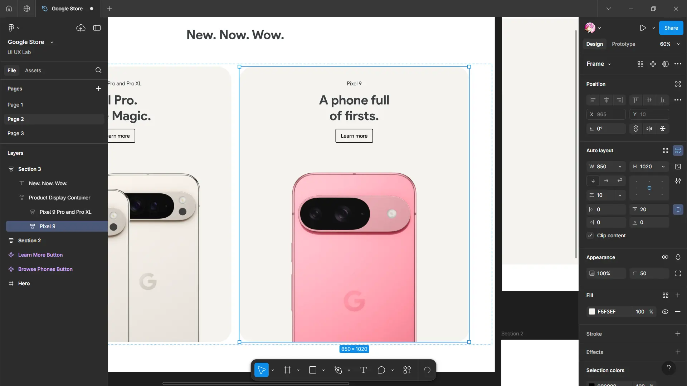

# Product Website

Our fourth experiment focuses on designing and prototyping a product website page, including developing web pages, wireframes, user interfaces, and rollovers for a well-known tech platform.

For this experiment, we will concentrate on Google Store, a prominent online destination for purchasing Google hardware and accessories. Google Store exemplifies excellent user interface design through its intuitive navigation, clear visual hierarchy, and cohesive design elements. It provides a seamless experience for users to browse products, read specifications, and conveniently make purchases.

_Google Store Interface. Image source: Google Official Website, 2025._

Let's begin by designing the home screen interface for the Google Store, along with the product page interface.

> **Disclaimer**:
>
> The images, logos, and brand elements of Google used in this website redesign are the intellectual property of Google LLC and are utilized here for educational purposes only. This website is not affiliated with or endorsed by Google. All trademarks and copyrights are the property of their respective owners.
>
> This redesign illustrates how Google products can be integrated into user interface designs to enhance user experience. Please ensure that all usage of Google logos, icons, and products adheres to their brand guidelines. For any commercial use or modifications, please obtain the necessary permissions from Google.

---

## 1. Wireframing

Create a basic wireframe using pen and paper, as demonstrated below:

---

## 2. Designing

> **Disclaimer**:
>
> The images of Google Pixel devices and other products used in this tutorial are the intellectual property of Google LLC and are provided here for educational purposes only. All trademarks and copyrights are owned by their respective companies. By using these images, you acknowledge that you respect the rights of the original creators. For any commercial use or modifications, please ensure you obtain the necessary permissions from the copyright holders.
> You can download the Google Pixel images and other products **[here](https://violetto-rose.github.io/UI-UX/public/resources/pixel-images.zip)**.
>
> The Product Sans font is the intellectual property of Google LLC and is provided here for personal use only. This tutorial uses the font for educational purposes only. For commercial use, please ensure you obtain the appropriate license from the author. By downloading, you acknowledge that you respect the rights of the original creator.
> You can download the Product Sans font **[here](https://violetto-rose.github.io/UI-UX/public/resources/Product-Sans.zip)**.

### ▶ Creating Browse Phones Button and Learn More Button Components

In Figma, components are reusable design elements (like buttons, icons, or layouts) that help maintain consistency and efficiency across your designs.

We will be using this to create rollover effects.

1. Create a frame:
	- Dimensions: **Hug**
	- Layout: Vertical
	- Alignment: Center
	- Horizontal padding: **20** pixels
	- Vertical padding: **14** pixels

2. Convert it into a component by pressing **Ctrl+Alt+K**.

3. Now, add a variant named "Hover" for the desired rollover effect with the following configuration:
    - Fill: **#3C4043** at 14% opacity

4. Connect the Default variant to the Hover variant using prototype effects:
    - Trigger: While hovering
    - Action: Change to
    - Animation: Dissolve
    - Curve: Ease in and out

5. Similarly, create a component for the Learn More button.

### ▶ Creating a Hero Page

To create a frame:

1. We'll use the **Presentation Slide (16:9)** frame for this design.

### ▶ Creating the Navigation Bar

1. Create the navigation frame:
    - Dimensions: **1920 x 70** pixels
    - Layout: Horizontal
    - Alignment: Center
    - Gap: Auto
    - Horizontal padding: **70** pixels
    - Vertical padding: **0**
2. Change the prototype of navigation bar:
    - Position: Fixed

### ▶ Adding the Links

1. Create a links frame:
    - Dimensions: **Hug x Fill**
    - Layout: Horizontal
    - Alignment: Center
    - Gap: **20** pixels
 

2. Add a Google icon.
3. Add text element for Phones, Earbuds, Watches & Trackers, Accessories and Support:
    - Color: **#3C4043**
 

### ▶ Adding the Buttons

1. Create a buttons frame:
    - Dimensions: **Hug x Fill**
    - Layout: Horizontal
    - Alignment: Center
    - Gap: **25* pixels

2. Add a Search, Cart and Profile icon:
    - Color: **#3C4043**

### ▶ Creating Section 1

1. Create a frame:
    - Dimensions: **1920 x Hug** pixels
    - Layout: Vertical
    - Alignment: Top Center
    - Gap: **40** pixels
    - Horizontal padding & Vertical padding: **0**
    - Fill: **#F5F3EF**

### ▶ Adding Header Container

1. Create a frame:
    - Dimensions: **Fill x Hug**
    - Layout: Vertical
    - Alignment: Center
    - Gap: **25** pixels
    - Horizontal padding: **0**
    - Vertical padding: **60, 0, 0, 0** pixels

### ▶ Adding Text Container and Browse Phones Button

1. Create a frame:
    - Dimensions: **Hug**
    - Layout: Vertical
    - Alignment: Center
    - Vertical padding: **0**

2. Add "Oh hi, Gemini." text:
    - Font: Product Sans
    - Size: **68** pixels
    - Weight: Bold
    - Color: Linear gradient (**#217BFE** to **#078EFB** to **#AC87EB** to **#EE4D5D**)

3. Add "Meet the new Pixel 9 Pro XL, Pixel 9 Pro, Pixel 9 and Pixel 9 Pro Fold with Gemini." text:
    - Font: Product Sans
    - Size: **20** pixels
    - Color: **#3C4043**

### ▶ Adding Browse Phones Button and Pixel Device Image Container

1. Add the button component from assets.

2. Add "pixel-devices" from the images file provide above:
    - Dimensions: **1920 x 579** pixels

### ▶ Creating Section 2

1. Create a frame:
    - Dimensions: **1920 x Hug**
    - Layout: Vertical
    - Alignment: Center
    - Gap: **70** pixels
    - Horizontal padding: **190** pixels
    - Vertical padding: **180** pixels

2. Add "Our Top Recommendations." text:
    - Font: Product Sans
    - Size: **48** pixels
    - Weight: Bold

### ▶ Adding Product Container

1. Create a frame:
    - Dimensions: **Fill x Hug**
    - Layout: Horizontal
    - Alignment: Top Left
    - Gap: **20** pixels
    - Horizontal padding: **0, 10** pixels
    - Vertical padding: **0, 20** pixels
2. Change the prototype of product container:
    - Overflow: Horizontal

### ▶ Adding Products

1. Create a frame:
    - Dimensions: **290 x Hug** pixels
    - Layout: Vertical
    - Alignment: Left
    - Gap: **20** pixels
    - Horizontal padding & Vertical padding: **0**

2. Add a frame for products image:
    - Dimensions: **290 x 345** pixels
    - Layout: Vertical
    - Alignment: Top Left
    - Horizontal padding & Vertical padding: **20** pixels
    - Image: Pixel 9 Pro and Pro XL
    - Fill: **#F8F9FA**
    - Corner radius: **20** pixels

3. Add a optional container for "New" tag:
    - Dimensions: **45 x 25** pixels
    - Layout: Horizontal
    - Alignment: Center
    - Horizontal padding & Vertical padding: **0**
    - Fill: **#E8F0FE**
    - Corner radius: **50** pixels
4. Add "New" text element:
    - Color: **#062E6F**

5. Add "Pixel 9 Pro and Pro XL" text below products image container:
    - Font: Product Sans
    - Size: **20** pixels
    - Weight: Bold
    - Color: **#3C4043**

### ▶ Duplicating Products

1. Duplicate the product container for other devices:
    - Pixel 9 (pixel-9)
    - Pixel 9 Pro Fold (pixel-9-pro-fold)
    - Pixel Watch 3 (pixel-watch-3)
    - Pixel Buds Pro 2 (pixel-buds-pro-2)
    - Pixel Buds A-Series (pixel-buds-series-a)
    - Pixel 8a (pixel-8a)
    - Pixel cases (pixel-cases)

### ▶ Creating Section 3

1. Create a frame:
    - Dimensions: **1920 x Hug** pixels
    - Layout: Vertical
    - Alignment: Center
    - Gap: **80** pixels
    - Vertical padding: **100** pixels
2. Add "New. Now. Wow." text:
    - Font: Product Sans
    - Size: **48** pixels
    - Weight: Bold
    - Color: **#3C4043**

### ▶ Adding Product Display Container

1. Create a frame:
    - Dimensions: **Fill x Hug**
    - Layout: Wrap
    - Alignment: Center
    - Gap: **30** pixels

### ▶ Creating a container for Pixel 9 Pro and Pro XL

1. Create a frame:
    - Dimensions: **850 x 1020** pixels
    - Layout: Vertical
    - Alignment: Center
    - Horizontal padding: **0**
    - Vertical padding: **20, 0** pixels
    - Fill: **#F5F3EF**
    - Corner radius: **50** pixels

2. Create a frame for description container:
    - Dimensions: **Fill x Hug**
    - Layout: Vertical
    - Alignment: Center
    - Gap: **20** pixels
    - Vertical padding: **30** pixels

3. Add "Pixel 9 Pro and Pro XL" text:
    - Font: Product Sans
    - Size: **20** pixels
    - Color: **#3C4043**
4. Add "All Pro. Pure Magic." text:
    - Font: Product Sans
    - Size: **48** pixels
    - Weight: Bold
    - Color: **3C4043**
5. Add the Learn More button component.

6. Add "pixel-9-pro-and-pro-xl" image:
    - Dimensions: **Fill**

### ▶ Creating a container for Pixel 9

1. Duplicate Pixel 9 Pro and Pro XL container.
2. Change "Pixel 9 Pro and Pro XL" text to "Pixel 9" and "All Pro. Pure Magic." to "A phone full of firsts.".
3. Change the image to "pixel-9".

### ▶ Creating a container for Pixel 9 Pro Fold

1. Duplicate Pixel 9 Pro and Pro XL container.
2. Change frame configuration:
    - Dimensions: **1730 x 850** pixels
3. Change "Pixel 9 Pro and Pro XL" text to "Pixel 9 Pro Fold" and "All Pro. Pure Magic." to "An epic display of Google AI.".
4. Change the image to "pixel-9-pro-fold-full".

### ▶ Creating a container for Pixel Watch 3

1. Duplicate Pixel 9 Pro and Pro XL container.
2. Change frame configuration:
    - Dimensions: **850 x 1400** pixels
3. Change "Pixel 9 Pro and Pro XL" text to "Pixel Watch 3" and "All Pro. Pure Magic." to "Goals. Guidance. Gorgeous.".
4. Change the image to "pixel-watch-3-full".

### ▶ Creating a container for Pixel Buds Pro 2

1. Duplicate Pixel Watch 3 container.
2. Change "Pixel Watch 3" text to "Pixel Buds Pro 2" and "Goals. Guidance. Gorgeous." to "Light ears ahead.".
3. Change the image to "pixel-buds-pro-2-full".

### ▶ Creating a container for Nest Cam

1. Duplicate Pixel 9 Pro Fold container.
2. Change frame configuration:
    - Layout: Horizontal
    - Alignment: Left
3. Change "Pixel 9 Pro Fold" text to "Nest Cam (battery)" and "An epic display of Google AI." to "Peace of mind in more places.".
4. Change the image to "nest-cam".

### ▶ Creating a container for Nest Mini

1. Duplicate Pixel 9 Pro and Pro XL container.
2. Change frame configuration:
    - Dimensions: **850 x 1000** pixels
3. Change "Pixel 9 Pro and Pro XL" text to "Nest Mini (2nd gen)" and "All Pro. Pure Magic." to "Still mini. Even more mighty.".
4. Change the image to "nest-mini-2nd-gen".

### ▶ Creating a container for Nest Audio

1. Duplicate Nest Mini container.
2. Change Nest Mini (2nd gen)" to "Nest Audio" and "Still mini. Even more mighty." to "Amazing sound. At your command.".
3. Change the image to "nest-audio".

### ▶ Connecting all 3 sections

1. Move all the 3 sections inside Hero.
2. Change the prototype of hero:
    - Overflow: Vertical

### ▶ Final Design

Through our focused efforts, we have developed a well-structured and visually appealing design for the Google Store interface. This design prioritizes user engagement and navigation ease, ensuring a streamlined experience for customers exploring Google’s hardware and accessories.

---
