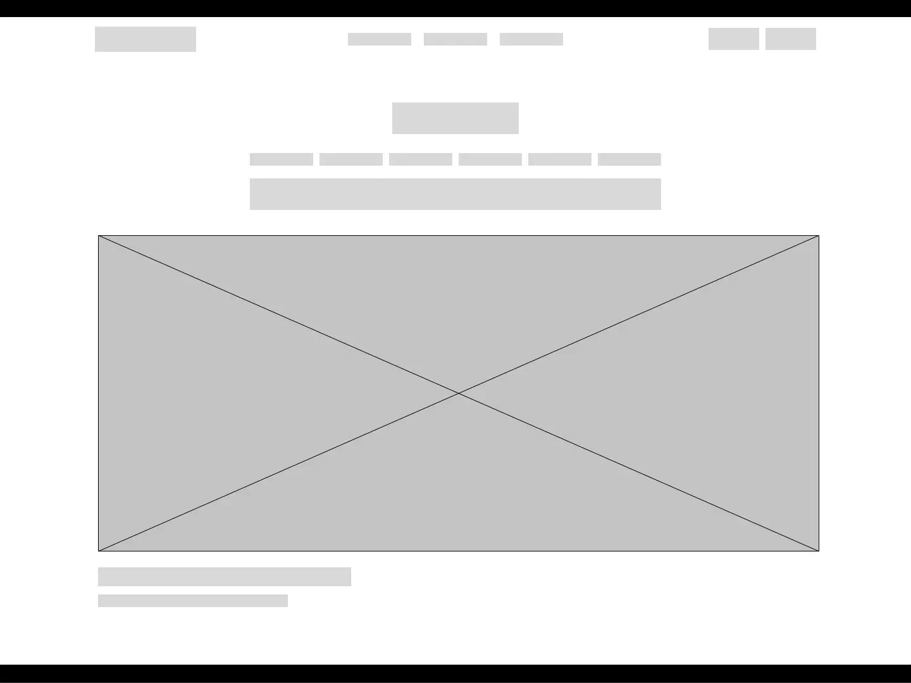
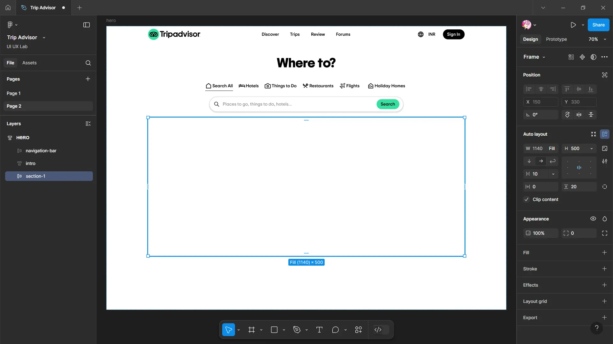
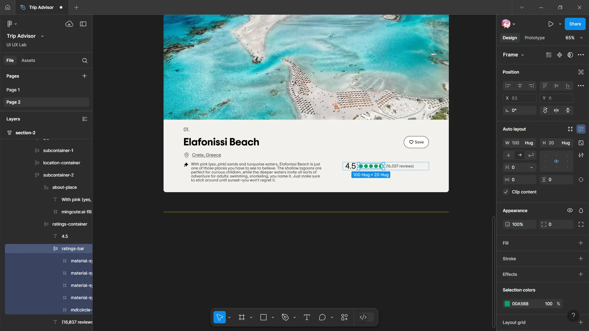

# Travel Agency Website

Our fifth experiment involves creating a wireframe and prototyping the UI for a travel agency website, featuring designs for the Home Page with a search bar, Activities page, Client Testimonial page, and Image Gallery.

For this experiment, we will focus on <span class="brand TripAdvisor">TripAdvisor</span>, a leading online platform for travel planning and discovery. TripAdvisor exemplifies excellent user interface design through its intuitive search functionality, user-friendly navigation, and organized presentation of travel-related information. It offers a seamless experience for users to explore destinations, read reviews, compare prices, and plan their trips efficiently. The website's design ensures that travelers can easily find what they're looking for, from hotels and restaurants to activities and itineraries, all while providing a visually appealing and cohesive interface.


_TripAdvisor Interface. Image source: TripAdvisor Official Website, 2025._

Let’s begin the design process by developing the home screen interface for TripAdvisor, along with the explore page interface.

> **Disclaimer**:
> 
> The images, logos, and brand elements associated with TripAdvisor used in this website redesign are the intellectual property of TripAdvisor and are employed here for educational purposes only. This website is not affiliated with or endorsed by TripAdvisor. All trademarks and copyrights are the property of their respective owners.
> 
> This redesign demonstrates how travel-related features can be integrated into user interface designs to enhance user experience. Please ensure that all usage of TripAdvisor logos, icons, and services complies with their brand guidelines. For any commercial use or modifications, please obtain the necessary permissions from TripAdvisor.

---
## 1. Wireframing

Create a basic wireframe using pen and paper, as demonstrated below:



---
## 2. Designing

> **Disclaimer**:
> 
> The images of TripAdvisor services and other travel-related content used in this tutorial are the intellectual property of TripAdvisor and are provided here for educational purposes only. All trademarks and copyrights are owned by their respective companies. By using these images, you acknowledge that you respect the rights of the original creators. For any commercial use or modifications, please ensure you obtain the necessary permissions from the copyright holders.  
> You can download TripAdvisor images and other travel-related content **[here](https://violetto-rose.github.io/UI-UX/public/resources/Trip-Advisor.zip)**.
> 
> The font used in this tutorial is the intellectual property of its respective creator and is provided here for personal use only. This tutorial uses the font for educational purposes only. For commercial use, please ensure you obtain the appropriate license from the author. By downloading, you acknowledge that you respect the rights of the original creator.  
> You can download the font **[here](https://violetto-rose.github.io/UI-UX/public/resources/Trip-Sans.zip)**.

### ▶ Creating a Hero Page

To create a frame:

1. We'll use the **Desktop** frame for this design:
	- Layout: Vertical
	- Alignment: Top Center
	- Gap: **0**
	- Horizontal padding: **150** pixels
	- Vertical padding: **0**


### ▶ Creating the Navigation Bar

1. Create the navigation frame:
	- Dimensions: **Fill x 60** pixels
	- Layout: Horizontal
	- Alignment: Center
	- Horizontal padding & Vertical padding: **0**
2. Change the prototype of navigation bar:
	- Position: Fixed


3. Add "trip-advisor" from the images file provide above.


4. Create navigation button container:
    - Dimensions: **Fill**
    - Layout: Horizontal
    - Alignment: Center
    - Horizontal padding & Vertical padding: **0**


5. Add buttons for Discover, Tips, Review & Forums.


6. Create more button container:
    - Dimensions: **Hug x Fill**
    - Layout: Horizontal
    - Alignment: Center
    - Horizontal padding & Vertical padding: **0**


7. Add buttons for Currency and Sign In.


### ▶ Creating Introduction Section

1. Create a frame:
    - Dimensions: **Fill x Hug**
    - Layout: Horizontal
    - Alignment: Center
    - Gap: **20** pixels
    - Horizontal padding: 0
    - Vertical padding: **50, 20** pixels


2. Add text box:
	- Dimensions: **Hug**
	- Horizontal padding: **0**
	- Vertical padding: **0, 20** pixels


3. Create a frame for services toolbar:
    - Dimensions: **Hug**
    - Layout: Horizontal
    - Alignment: Top Left
    - Gap: **20** pixels
    - Horizontal padding & Vertical padding: **0**
4. Add buttons for Search All, Hotels, Things to do, Restaurants, Flights and Holiday Homes.


5. Create a frame for search bar:
    - Dimensions: **700 x Hug** pixels
    - Layout: Horizontal
    - Alignment: Center
    - Gap: **0**
    - Horizontal padding: **15** pixels
	- Stroke: 
		- Color: **#E0E0E0**
		- Position: Inside
		- Thickness: **2** pixels
	- Effects: Drop Shadow
		- X: 0
		- Y: 2
		- Blur: 3
		- Color: **#000000** at 25% opacity


6. Add search icon
7. Add text input:
	- Dimensions: **Fill**
	- Align: Left
8. Add a search button:
	- Fill: **#34E0A1**


### ▶ Creating Section 1

1. Create a frame:
    - Dimensions: **Fill x 500** pixels
    - Layout: Horizontal
    - Alignment: Center
    - Horizontal padding: **0**
    - Vertical padding: **20** pixels



2. Create a AI frame:
    - Dimensions: **Fill x 460** pixels
    - Layout: Vertical
    - Alignment: Left
    - Gap: **0**
    - Horizontal padding: **80** pixels
    - Vertical padding: **50, 30** pixels
    - Fill: Add "banner" image from images folder


3. Add powered by AI container:
	- Dimensions: **Hug**
	- Gap: **4** pixels
	- Horizontal padding & Vertical padding: **0**


4. Add trip text container:
	- Dimensions: **Hug**
	- Alignment: Left
	- Gap: **0** 
	- Horizontal padding: **0** 
	- Vertical padding: **10, 20** pixels
5. Add text elements:

```plaintext
Plan your kind of
trip
```

```plaintext
Get custom recs for all the  
things you’re into with AI trip  
builder.
```

6. Add start a trip with AI button.


### ▶ Creating Section 2

1. Create a frame:
    - Dimensions: **Fill x Hug**
    - Layout: Horizontal
    - Alignment: Left
    - Gap: **16** pixels
    - Horizontal padding & Vertical padding: **0**


2. Add text elements: 

```plaintext
Explore the world’s most stunning seasides
```

```plaintext
2025’s Travellers’ Choice Awards Best of the Best Beaches
```


3. Create places container:
    - Dimensions: **Fill x Hug**
    - Layout: Vertical
    - Alignment: Left
    - Horizontal padding: **0**
    - Vertical padding: **20** pixels


4. Create places sub container:
    - Dimensions: **273 x 273** pixels
    - Layout: Vertical
    - Alignment: Bottom Center
    - Horizontal padding: **0**
    - Vertical padding: **20** pixels
    - Fill: Add "world" image from places folder


5. Add text container:
    - Dimensions: **Fill x Hug**
    - Alignment: Bottom Left
    - Horizontal padding & Vertical padding: **20** pixels
    - Fill: Linear gradient
		- From: **#000** (0% opacity) at **0%**
		- To: **#000** (60% opacity) at **40%**
		- To: **#000** (60% opacity) at **100%**


6. Duplicate the Places Box for:
    - Europe
    - Asia
    - South Pacific


### ▶ Creating a Explore Page

To create a frame:

1. We'll use the **Desktop** frame for this design:
	- Layout: Vertical
	- Alignment: Top Center
	- Gap: **0**
	- Horizontal padding: **150** pixels
	- Vertical padding: **0


### ▶ Creating the Navigation Bar

1. Create the navigation frame:
	- Dimensions: **Fill x Hug**
	- Layout: Vertical
	- Alignment: Center
	- Gap: **0**
	- Horizontal padding & Vertical padding: **0**
2. Change the prototype of navigation bar:
	- Position: Fixed


3. Create the top navigation frame:
	- Dimensions: **Fill x 60** pixels
	- Layout: Horizontal
	- Alignment: Center
	- Gap: Auto
	- Horizontal padding & Vertical padding: **0**


4. Add the TripAdvisor image, search bar, and buttons from navigation bar in the hero page.


5. Create the bottom navigation frame:
	- Dimensions: **Fill x 60** pixels
	- Layout: Horizontal
	- Alignment: Bottom Left
	- Gap: **20** pixels
	- Horizontal padding & Vertical padding: **0**


6. Add buttons from services tool bar in the hero page.


### ▶ Creating the Directory structure

1. Create a frame:
	- Dimensions: **Fill x Hug**
	- Layout: Vertical
	- Alignment: Center
	- Gap: Auto
	- Horizontal padding: **0**
	- Vertical padding: **16** pixels
2. Add text element:

```plaintext
Travelers' Choice > Beaches > World
```

```plaintext
Best of the Best Beaches in the World
```


### ▶ Creating the Beach section

1. Create a frame:
	- Dimensions: **1440 x 480** pixels
	- Layout: Vertical
	- Alignment: Bottom Left
	- Gap: **40** pixels
	- Horizontal padding: **170** pixels
	- Vertical padding: **68** pixels
	- Fill: Add "beach" image from images folder
	- Fill: Linear gradient
		- From: **#000** (0% opacity) at **60%**
		- To: **#000** (60% opacity) at **90%**
		- To: **#000** (60% opacity) at **100%**


2. Create a badge container:
	- Dimensions: **Hug**
	- Layout: Horizontal
	- Alignment: Center
	- Horizontal padding: **0**
	- Vertical padding: **6** pixels
3. Add "badge" image from images folder.


4. Add beach text container:
	- Dimensions: **Hug**
	- Layout: Bottom Left
	- Alignment: Center
	- Horizontal padding & Vertical padding: **0**
5. Add text element:

```plaintext
Travellers’ Choice Awards
```

```plaintext
Best of the Best Beaches
```


### ▶ Creating Section 1

1. Create a frame:
    - Dimensions: **Fill x Hug**
    - Layout: Vertical
    - Alignment: Left
    - Gap: **16** pixels
    - Horizontal padding: **0**
    - Vertical padding: **40** pixels


2. Add text element:

```plaintext
World
```

```plaintext
Whether you’re looking to laze on soft sands or dive into new adventures, this year’s winning beaches promise a  
dreamy escape.
```

```plaintext
The Travelers' Choice Awards Best of the Best title celebrates the highest level of excellence in travel. It’s awarded to  
those who receive a high volume of above-and-beyond reviews and opinions from the Tripadvisor community over a 12-  
month period. Out of our 8 million listings, fewer than 1% achieve this milestone.
```


### ▶ Creating Section 2

1. Create a frame:
    - Dimensions: **Fill x Hug**
    - Layout: Vertical
    - Alignment: Center
    - Horizontal padding : **0** 
    - Vertical padding: **30, 80** pixels
    - Stroke: 
		- Color: **#F2B203**
		- Position: Inside
		- Sides: Top & Bottom


2. Create a place card container:
    - Dimensions: **Fill x Hug**
    - Layout: Vertical
    - Alignment: Top Left
    - Horizontal padding & Vertical padding : **0** 
    - Cornering radius: **10** pixels
    - Fill: **#F2F1EC**


3. Create a image container:
    - Dimensions: **Fill x 512** pixels
    - Fill: Add "elafonissi-beach" image from images folder.


4. Create a description container:
    - Dimensions: **Fill x Hug**
    - Layout: Vertical
    - Alignment: Left
    - Gap: **16** pixels
    - Horizontal padding: **80** pixels
    - Vertical padding : **20** pixels


5. Add "01." text element.
6. Create a sub container:
    - Dimensions: **Fill x Hug**
    - Layout: Horizontal
    - Alignment: Left
    - Gap: Auto
	- Horizontal padding & Vertical padding : **0** 


7. Add "Elafonissi Beach" text element.
8. Add a save button.


9. Create a location container:
    - Dimensions: **Hug**
    - Layout: Horizontal
    - Alignment: Center
	- Horizontal padding & Vertical padding : **0** 
10. Add location icon and "Crete, Greece" text element:
	- Color: **#333**


11. Create another sub container:
    - Dimensions: **Fill x Hug**
    - Layout: Horizontal
    - Alignment: Top
    - Gap: Auto
	- Horizontal padding & Vertical padding : **0** 


12. Create about place container:
    - Dimensions: **Hug**
    - Layout: Horizontal
    - Alignment: Bottom Left
	- Horizontal padding & Vertical padding : **0** 
13. Add AI icon.
14. Add text element:

```plaintext
With pink (yes, pink) sands and turquoise waters, Elafonissi Beach is just  
one of those places you have to see to believe. The shallow lagoons are  
perfect for curious children, while the deeper waters invite all sorts of  
adventure for adults: swimming, snorkeling, you name it. Just make sure  
to stick around until sunset—you won't regret it.
```


15. Create about ratings container:
    - Dimensions: **Hug**
    - Layout: Horizontal
    - Alignment: Bottom Left
	- Horizontal padding & Vertical padding : **0** 
16. Add "4.5" text element.
17. Create a ratings bar using icons:
	- Color: **#00A568**
18. Add "(16,037 reviews)" text element.



19. Create a review container:
    - Dimensions: **Fill x Hug**
    - Layout: Vertical
    - Alignment: Left
    - Horizontal padding & Vertical padding : **0** 


20. Create a review container:
    - Dimensions: **Hug**
    - Layout: Horizontal
    - Alignment: Left
    - Horizontal padding & Vertical padding : **20** pixel
    - Cornering radius: **6** pixels
	- Stroke: 
		- Color: **#E0E0E0**
		- Position: Inside


21. Duplicate the ratings bar.
22. Add text element:

```plaintext
Sep 2024 • Couples Way overrated beach. Terribly  
crowded and a long walk from the coach park. Few  
chairs available and poor facilities. It was pink, so what.  
This is definitely not the best beach in Europe, or even  
Crete.
```


23. Create a original poster container:
    - Dimensions: **Fill x Hug**
    - Layout: Horizontal
    - Cornering radius: **6** pixels
	- Stroke: 
		- Color: **#E0E0E0**
		- Position: Inside
		- Sides: Top


24. Add Ellipse:
	- Dimensions: **40** pixels
25. Add "@934freef" and "Reviewed April 2025" text elements.


26. Duplicate reviews: 

```plaintext
There’s no other word to describe this beach. It’s one of  
the best beaches ever. Not too easy to reach as the it’s a  
long way to get here and even a little bit crowdy but the  
nature here is at its best. Rose sand and crystal water.  
No need to get anywhere else.
```

- Change text element to "@ReCensore1980", "Reviewed April 2025".

```plaintext
My family said it was the worst beach in the world. I  
found a cockroach at the beach bar, a pamphlet  
pancakes, a prosthetic grotesque. Your mother told me,  
and then I told him what you said, and he told me not to  
talk.
```

- Change text element to "@_R4585FH", "Reviewed February 2025".


### ▶ Creating a Full Search bar 

1. Create a frame:
	- Dimensions: **700 x Hug** pixels
	- Layout: Vertical
	- Alignment: Center
	- Gap: **0**
	- Horizontal padding: **50** pixels
	- Vertical padding: **0, 10** pixels


2. Create a frame for search input:
    - Dimensions: **Fill x Hug**
    - Layout: Horizontal
    - Alignment: Center
    - Gap: **0**
    - Horizontal padding: **0**
	- Stroke: 
		- Color: **#000**
		- Position: Inside
		- Sides: Bottom


3. Create location search container:
	- Dimensions: **Fill x Hug**
	- Layout: Vertical
	- Alignment: Center
	- Gap: **0**
	- Horizontal padding: **0**
	- Vertical padding: **10, 0** pixels


4. Create two containers for "Nearby" and "Pigeon Forge".
5. Add "pigeon-forge" image from search folder


6. Add "Popular Destinations" text element.
7. Create destination search container:
	- Dimensions: **Fill x Hug**
	- Layout: Vertical
	- Alignment: Center
	- Gap: **0**
	- Horizontal padding: **0**
	- Vertical padding: **10, 0** pixels
8. Create five containers for "Hyderabad", "Chikmagalur", "Baga", "Dubai" and "Cabo San Lucas".
9. Add respective images from search folder


### ▶ Connect the pages using the Prototype option

1. Connect full search bar to search bar as overlay:
	- Trigger: On click
	- Action: Open overlay
	- Overlay: Full Search bar
	- Position: Manual
	- ✓ Close when clicking outside
	- ✓ Background: **#000** at 25% opacity
	- Animation: Instant


2. Connect the **World** places sub container to the **explore** page.
3. Connect the **TripAdvisor** image in explore to return to the **hero** page.


### ▶ Final Design

Through our focused efforts, we have developed a well-structured and visually appealing design for the TripAdvisor interface. This design prioritizes user engagement and ease of navigation, ensuring a seamless experience for travelers exploring destinations, accommodations, and activities. Our interface aims to inspire users while simplifying the process of planning their trips, making travel discovery enjoyable and efficient.


---